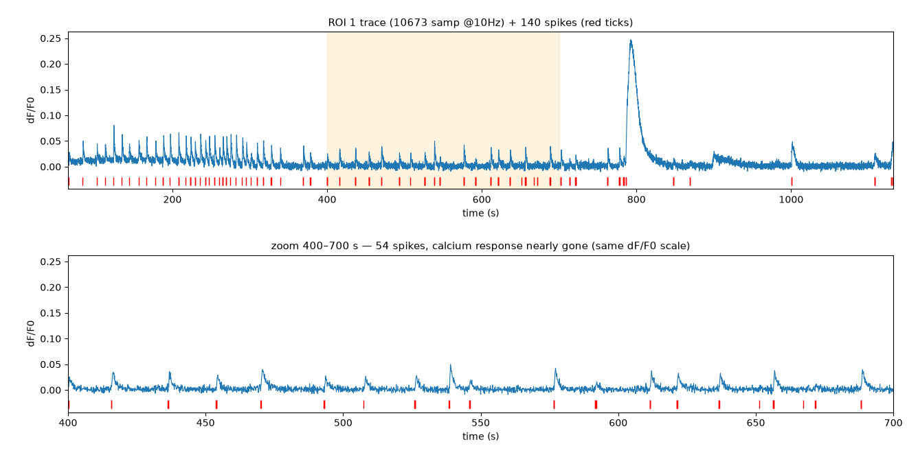

# Colonel Kernel

A client-side 1D convolution / deconvolution tool for calcium imaging — a teaching demonstrator and a ground-truth kernel-verification instrument.

## Why this tool exists



This is ROI 1 of a real paired recording — the cleanest spike/calcium coupling in the dataset. The red ticks are 140 action potentials; the blue trace is the calcium signal. Even here, the relationship is not one-to-one: the large transient near 780 s has no matching burst of spikes, and through 400–700 s the spikes continue while the calcium response shrinks. Colonel Kernel exists to **measure** this relationship — to recover the kernel that links spikes to calcium, or to show when no single kernel does — not to assume the two are coupled. (See [FOUNDATIONS](FOUNDATIONS.md) §3–4.)

## Dependency health (team process)

Two standing checks — **Defense** (no known-vulnerable dependency) and **Up-to-date** (no silently
frozen dependency) — are part of the dev process, enforced by `npm audit`, Dependabot, and a
freshness workflow. See [docs/DEPENDENCY_HEALTH.md](docs/DEPENDENCY_HEALTH.md). It is written to be
adopted verbatim by the sibling Vite/Svelte project.

## Recommended IDE Setup

[VS Code](https://code.visualstudio.com/) + [Svelte](https://marketplace.visualstudio.com/items?itemName=svelte.svelte-vscode).

## Need an official Svelte framework?

Check out [SvelteKit](https://github.com/sveltejs/kit#readme), which is also powered by Vite. Deploy anywhere with its serverless-first approach and adapt to various platforms, with out of the box support for TypeScript, SCSS, and Less, and easily-added support for mdsvex, GraphQL, PostCSS, Tailwind CSS, and more.

## Technical considerations

**Why use this over SvelteKit?**

- It brings its own routing solution which might not be preferable for some users.
- It is first and foremost a framework that just happens to use Vite under the hood, not a Vite app.

This template contains as little as possible to get started with Vite + Svelte, while taking into account the developer experience with regards to HMR and intellisense. It demonstrates capabilities on par with the other `create-vite` templates and is a good starting point for beginners dipping their toes into a Vite + Svelte project.

Should you later need the extended capabilities and extensibility provided by SvelteKit, the template has been structured similarly to SvelteKit so that it is easy to migrate.

**Why include `.vscode/extensions.json`?**

Other templates indirectly recommend extensions via the README, but this file allows VS Code to prompt the user to install the recommended extension upon opening the project.

**Why enable `checkJs` in the JS template?**

It is likely that most cases of changing variable types in runtime are likely to be accidental, rather than deliberate. This provides advanced typechecking out of the box. Should you like to take advantage of the dynamically-typed nature of JavaScript, it is trivial to change the configuration.

**Why is HMR not preserving my local component state?**

HMR state preservation comes with a number of gotchas! It has been disabled by default in both `svelte-hmr` and `@sveltejs/vite-plugin-svelte` due to its often surprising behavior. You can read the details [here](https://github.com/sveltejs/svelte-hmr/tree/master/packages/svelte-hmr#preservation-of-local-state).

If you have state that's important to retain within a component, consider creating an external store which would not be replaced by HMR.

```js
// store.js
// An extremely simple external store
import { writable } from 'svelte/store'
export default writable(0)
```
